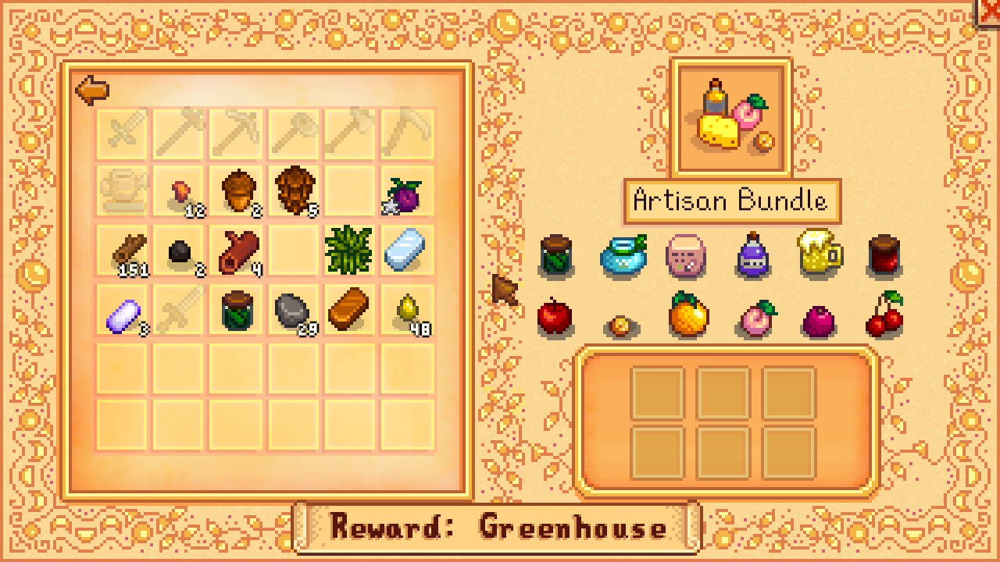
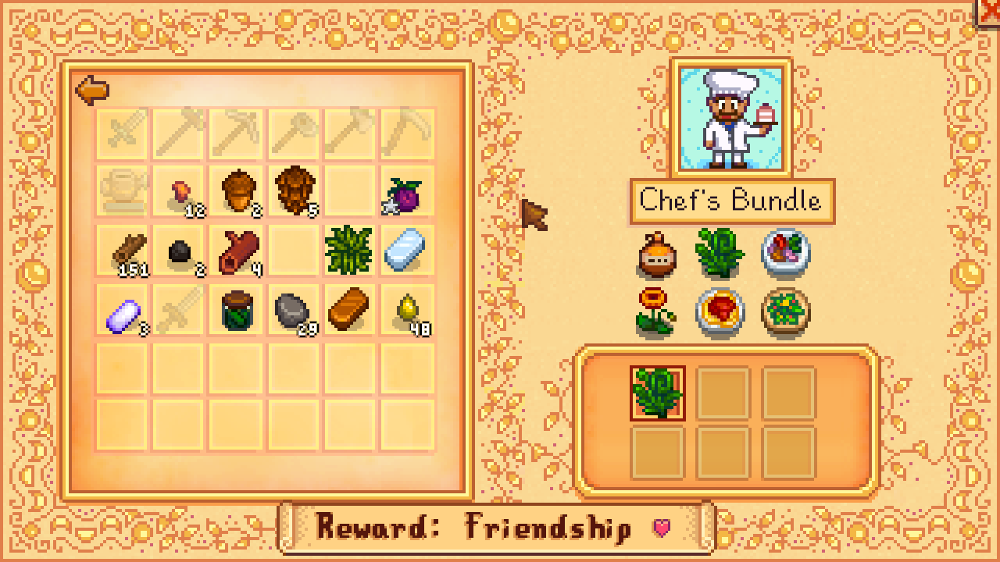
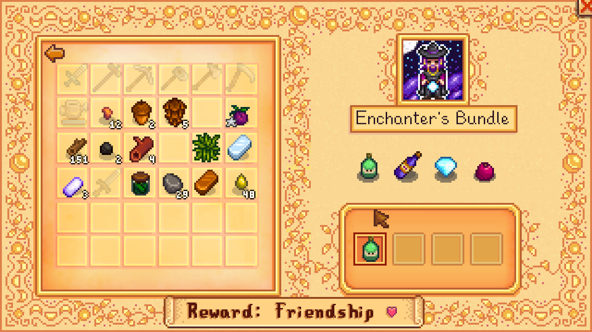
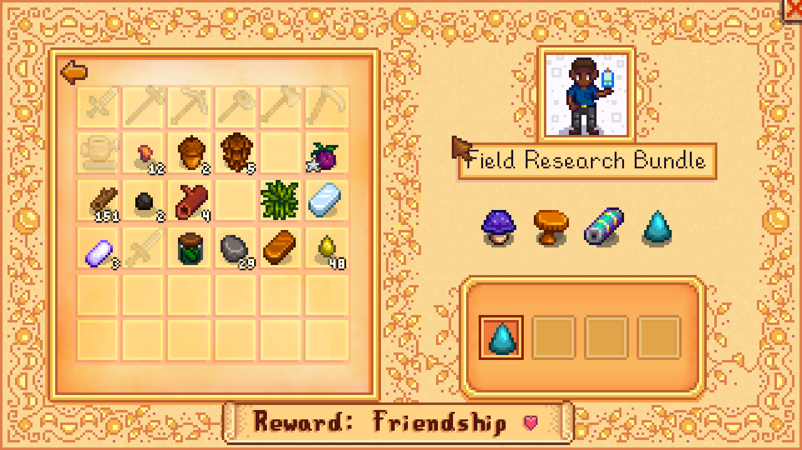
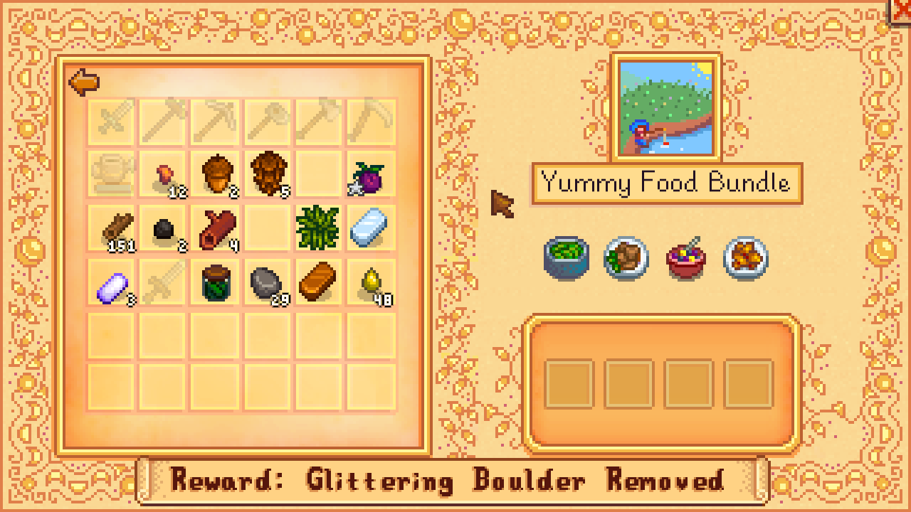
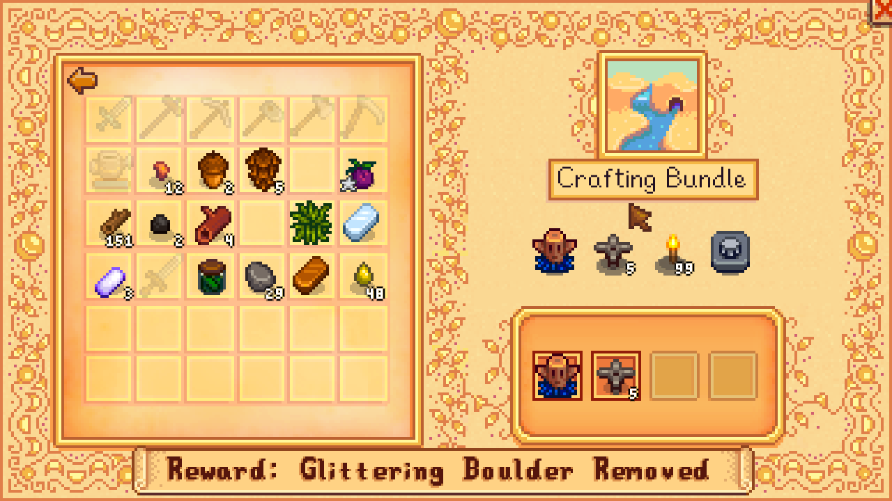
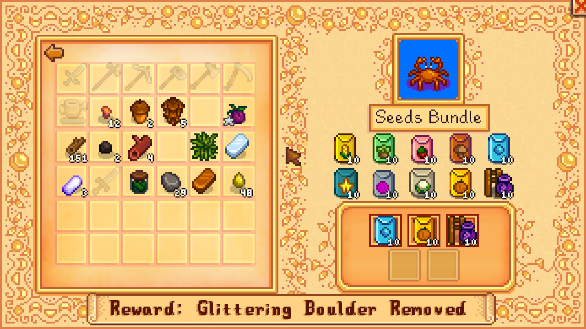
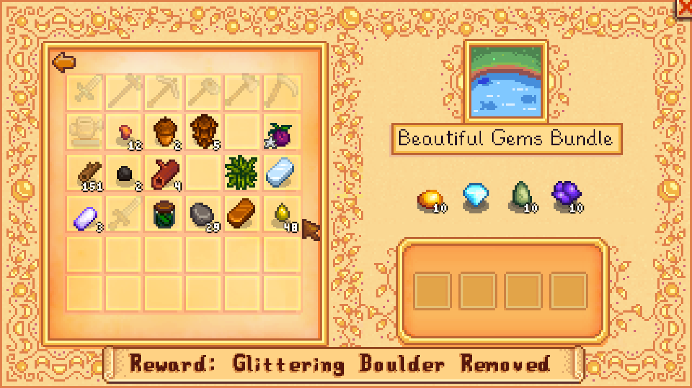

# Stardew Valley Vegan Mod
This mode enables completing the Community Center Arc without needed animal products
like milk, cheese or fish.

Also adds vegan related dialogs on Emily (when married).

This was made because I'm vegan and I wanted to complete the game in a vegan way, no fishing no farm animals and no food with animal ingredients. And of course not using the Joja Corporation path because they are evil and expensive.

## Installation
Copy `Bundles.xnb` replacing the file in `Data/Bundles.xnb` and optionally do the same with `MarriageDialogueEmily.xnb` in `Characters\Dialogue` inside the StarDew Valley files.

**Important**
 - Backup your files.
 - Use at your own risk.

## Compiling
Use https://github.com/draivin/XNBNode

## Screenshots

[Made with Love by Ninjas.cl](http://ninjas.cl)

