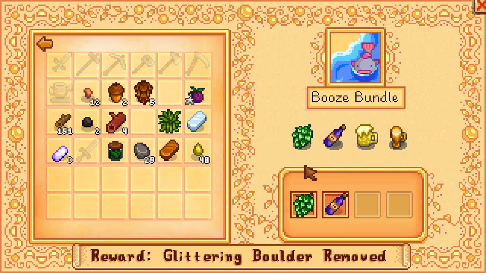

# Stardew Valley Vegan Mod
This mode enables completing the Community Center Arc without needed animal products
like milk, cheese or fish.

Also adds vegan related dialogs on Emily (when married).

This was made because I'm vegan and I wanted to complete the game in a vegan way, no fishing no farm animals and no food with animal ingredients. And of course not using the Joja Corporation path because they are evil and expensive.

## Installation
Copy `Bundles.xnb` replacing the file in `Data/Bundles.xnb` and optionally do the same with `MarriageDialogueEmily.xnb` in `Characters\Dialogue` inside the StarDew Valley files.

**Important**
 - Backup your files.
 - Use at your own risk.
 - This is beta, may crash the game. Currently tested on v1.1. Please report any issues.

## Compiling
Use https://github.com/draivin/XNBNode

## What's Different?
The mod simply changes the Community Center Requirements and Prizes.

### Fall Crops Bundle
Replaced `Bee House` Prize for `Preserves Jar` as Honey is not Vegan.

### Quality Crops Bundle
Replaced `Preserver Jar` for `Iridium Sprinkler` Because Quality Crops deserve a better prize.

### Animal Bundle
Animal Bundle Renamed to `Treasures Bundle` requiring artifacts and gems to be completed.
The prize is now 150 `Hardwood`. Rather than the `Cheese Press` as Cheese is not Vegan.

### Artisan Bundle
Artisan Bundle items like `Truffle Oil`, `Cloth`, `Goat Chesse`, `Cheese`, `Honey`, were replaced by other items items.
The prize is the same.

### Chef's Bundle
Replaced `Truffle`, `Maki Roll` and `Fried Egg` with `Autumn's Bounty`, `Spaghetti` and `Salad`.

### Dye Bundle
Replaced `Sea Urching` with `Grape` and `Duck Feather` for `Tulip`.

### Field Research Bundle
Replaced `Nautilus Shell` for `Chanterrelle` and `Chub` for `Battery`.

### Fodders Bundle
Replaced `Heater` for `Pomegranate Sapling`.

### Fish Tank Bundles
The Fish tank bundles were replaced by other requirements.

#### Yummy Food
Requiring prepared food instead of fish. All dished based on only plant based ingredients.
The prize is now 5 `Starfruit Seeds`.

#### Beautiful Gems
Requiring gems like `Topaz`, `Jade`, `Amethist` and `Diamond` to complete.
The prize is now 5 `Quality Sprinklers`.

#### Booze
Requiring items like `Hops`, `Wine`, `Beer` and `Pale Ale` to complete.
The prize is now 5 `Warp Totem Farm`.

#### Spicy Salad
Requiring items like `Hot Pepper`, `Corn` and `Bok Choy`.
The prize is now a `Glow Ring`.

#### Crafting
Requiring items like `Bomb`, 5 `Sprinkler` and 99 `Torches`.
The prize is now 5 `Energy Tonic`.

#### Seeds
Requiring various seeds.
The prize is now 5 `Cranberry Sauce`.

## Screenshots

[Made with Love by Ninjas.cl](http://ninjas.cl)

Special thanks to Martin Steigerwald for it's kind letter about this mod :)

